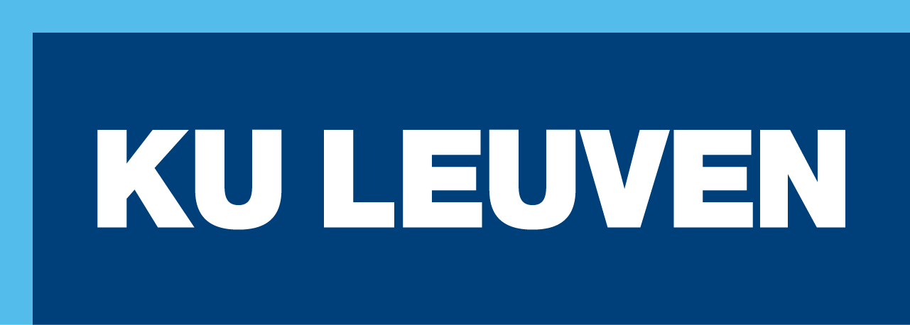
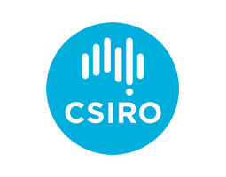

# DataDrivenImpedanceEstimationWithCarson
Should we rename this repository?

## Summary
This repository hosts a Julia package with code and data used to perform the estimation of (up to) four-wire impedance matrices for electric distribution networks, starting from measurement data (from smart meters, specifically).

From a mathematical standpoint, this is achieved through a joint (power system) state and impedance matrix estimation process. Such process maximizes the likelihood of time-variant electrical states (complex voltages/powers/currents) over a time series, by "fitting" time-invariant impedance matrix entries. Such entries are cast as functions of line and cable construction properties, i.e., distance between conductors, conductor thickness, etc., through Carson's equations.

The joint state and impedance estimation is implemented and solved as a nonlinear, non-convex mathematical optimization problem, using Julia's JuMP and the Ipopt wrapper.

Keywords: impedance matrix estimation, parameter estimation, power systems state estimation, unbalanced distribution system.

## Data and licenses

- The source code is available under a BSD-3 license (see [LICENSE](LICENSE) file)
- The yearly fifteen minute resolution power profiles are taken from the Open Energy Data Initiative’s (OEDI) dataset [“End-Use Load Profiles for the U.S. Building Stock”](https://data.openei.org/submissions/4520), and released with a CC BY 4.0 license, like the original OEDI active power profiles.
- The linecode data for the impedances, curated by GridQube and found in `data/linecode_library`, are released under a CC-BY 4.0 license. 
- The network data in `data/network_data` are in OpenDSS's (.dss) format and consist of the **four-wire** extension of Feeder 1, Network 1 and Feeder 5, Network 4 of the Electricity North West Limited (ENWL) [dataset](https://ieeexplore.ieee.org/iel7/59/4374138/07051294.pdf) from the [Low Voltage Network Solutions project](https://www.enwl.co.uk/go-net-zero/innovation/smaller-projects/low-carbon-networks-fund/low-voltage-network-solutions/).

Once available, we will put here links to our relevant paper/preprints **TBD**, [on arxiv](https://arxiv.org/).

## Citing this work
If you found this interesting and/or useful for your work, we kindly ask you to cite the following paper **WORK IN PROGRESS**:

@Misc{ID,  
author = {austhors},  
title = {title},  
howpublished = {\url{https://arxiv.org/}},  
year = {2024}  
}

## Funding

This project results from a collaboration between KU Leuven/EnergyVille (Leuven and Genk, Belgium), CSIRO Energy (Newcastle, NSW, Australia) and GridQube (Springfield Central, QLD, Australia).

This work received funding from the Agency for Innovation and Entrepreneurship of the Flemish Government (VLAIO) and Flux50, through the strategic research project IMPRO-CAP (Grant N°. HBC 2022 0733).

The collaboration involved a long overseas stay that received a grant from the Science Foundation: Flanders (FWO) (Grant N°. V420224N).

**XXXXXX project @rahmat to fill in from CSIRO, Fred also adds something?**. 

